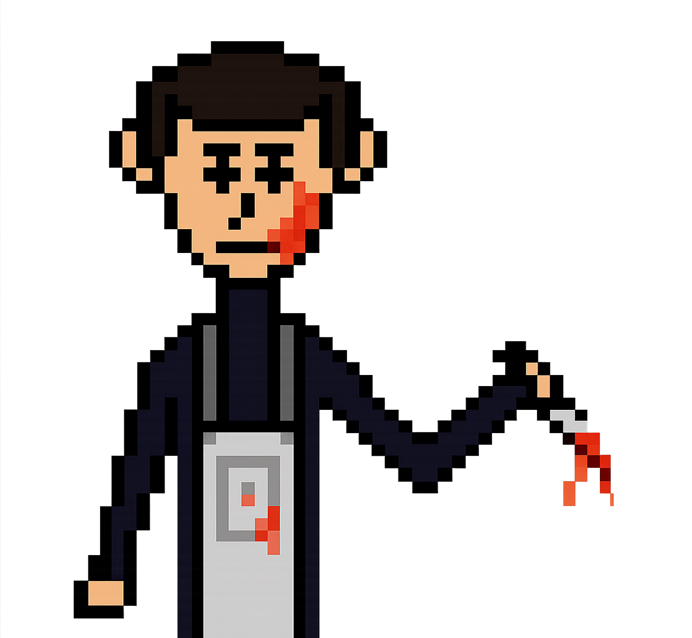

## Hossein Ziaazari

Game engine enthusiast who enjoys building systems close to the metal.

<!-- Typing Animation (Red) -->

  

### Skills
- **C++** — performance-focused programming and engine-level systems  
- **C#** — tools, utilities, and application development  
- **Python** — scripting, automation, and rapid prototyping  
- **Blender** — 3D asset creation and pipeline familiarity  
- **SDL** — windowing, input, and cross-platform multimedia foundations, including 2D rendering, textures, audio... 

### Interests
- Game engine programming and engine architecture  
- Low-level systems and performance optimization  
- Graphics programming and real-time rendering  
- Currently diving deeper into **OpenGL** and the graphics pipeline
